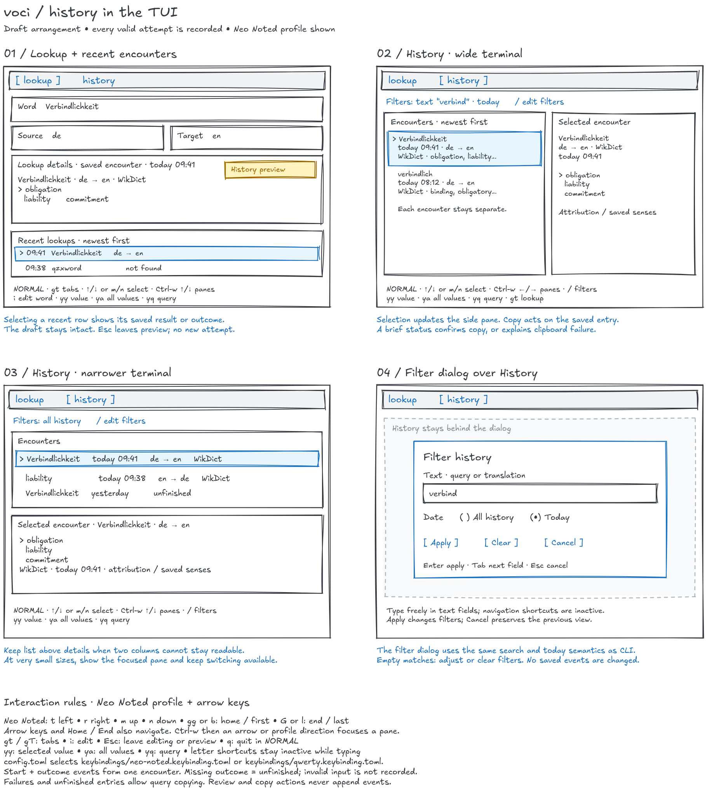
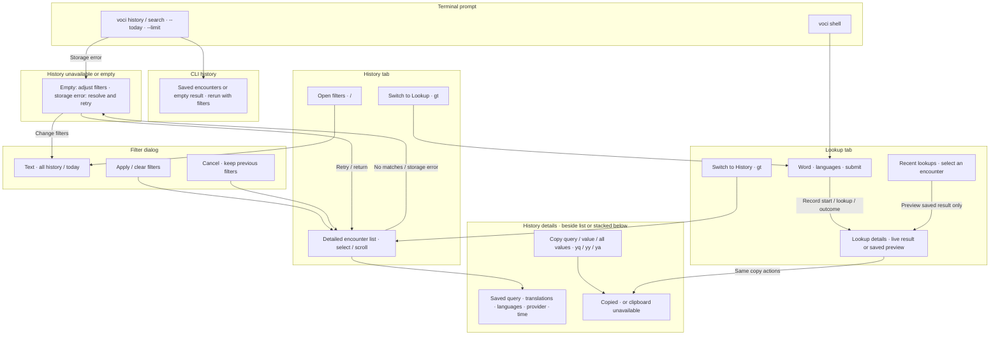

# Problem

Looking up a word solves the immediate question, but the word and its translations disappear when the terminal output or current TUI result is gone. A user who wants to learn those words later has to remember which words they encountered or copy each result elsewhere.

Voci needs a durable record of these encounters that the user can browse and filter in the terminal. Repeated encounters matter: looking up the same word tomorrow is another learning signal, even if its translations have not changed. This history supplies the material for a later flashcard workflow.

# Appetite

**Proposed appetite: two weeks.** This is a spending limit, not an estimate. It covers automatic SQLite persistence, CLI history and search, two TUI tabs with recent-history preview and adaptive details, a filter dialog, copying, and configurable Vim-style bindings.

Confirmed implementation boundary: flashcard practice is a later bet. Record every valid submitted lookup, including repeats, successes, misses, ambiguous or undetermined languages, setup/provider failures, and cancellations. Invalid input is rejected before recording. Persist the start before lookup work; an attempt without an outcome remains visible as unfinished after a hard stop.

If the work pushes against the appetite, simplify history presentation and navigation. Preserve automatic recording, repeated events, all translation candidates, both tabs, filtering, copy actions, and configurable bindings. Exact pane proportions, column density, and key-help presentation can stay simple.

# Solution

The solution has four elements: automatic capture, an append-only event history, CLI queries, and a TUI with Lookup and History tabs.

**Automatic capture.** Both `voci <word>` and submissions in `voci shell` record their valid submissions and outcomes through the shared application flow. The user does not need to mark a word or invoke a save command. Record a start and at most one terminal outcome per attempt; the provider calls used to infer the source language are not separate user lookups. Submitting the same word again creates another event.

Capture structured results before presentation shortens them. A word with several translations keeps all returned candidates together in one lookup event, preserving their order and available sense labels. Existing provider attribution travels with the saved result so history can present it later.

**Append-only event history.** A dedicated SQLite database in the user's application data directory is the source of truth for lookup history, separate from downloaded dictionary databases. Create it on the first valid submission. Dictionary replacement or re-download must not erase history.

Name the database `voci.db`, under voci's local application data directory:

| Environment | Database path |
| --- | --- |
| Linux, with an absolute `XDG_DATA_HOME` | `$XDG_DATA_HOME/voci/voci.db` |
| Linux, otherwise | `~/.local/share/voci/voci.db` |
| macOS | `~/Library/Application Support/voci/voci.db` |
| Windows | `%LOCALAPPDATA%\voci\data\voci.db` |

These paths follow the existing application's `ProjectDirs::from("", "", "voci").data_local_dir()` convention. Use the same database from every working directory and from both CLI and TUI. It is user data, not a cache, and `[wikdict].data_dir` does not relocate it. If the user data directory cannot be resolved or written, explain the storage problem rather than falling back to the current directory. History reads with no database remain a normal empty state. `[history].database` can select another path; relative paths resolve beside the effective config file. `--database PATH` overrides that setting for lookup, shell, history, and search, with relative flag paths resolved against the working directory. Development and manual TUI checks use an isolated database. Existing `history.sqlite3` files remain intact and can be selected explicitly; they are not automatically moved or merged.


Each attempt has an immutable start event and, when available, a terminal outcome event. A history entry combines them. Their data includes these fields:

| Field | Meaning |
| --- | --- |
| Lookup query | The user's submitted query, preserving spelling and case rather than replacing it with a normalized dictionary key. |
| Source language | Requested source, and resolved source when known; otherwise absent. |
| Target language | Requested target, and resolved target when known; otherwise absent. |
| Target value(s) | Complete ordered candidates for successful results; absent for other outcomes. |
| Lookup provider | The provider that produced this result. |
| Timestamps | Start and optional completion time, stored as unambiguous UTC instants. |
| Outcome | Success, not found, ambiguous, undetermined, failure, or cancellation; a missing outcome means unfinished. |

Give events stable identities and a format version so ordering and future interpretation do not depend on timestamps alone. Repeated queries append new events; they never upsert a vocabulary row, overwrite translations, or increment a counter in place. The event stream is authoritative. History and any future learning views derive from those saved events and can be rebuilt without querying a provider. This slice can read the events directly; it does not need a separate projection service.

Save each event atomically. A storage failure must be visible without hiding a useful translation: show the lookup result with a clear “history was not saved” warning and the database location. Keep the TUI usable, and do not silently discard or recreate a damaged database. No background retry queue is part of this bet.

**CLI queries.** Add the requested entry points:

```bash
voci history
voci history --today
voci history --limit 20
voci search verbindlich
```

History combines events into one entry per attempt, ordered by start time newest first, keeping repeated lookups visible. Each entry makes the query, language direction, translations, provider, and time readable. Use a bounded default of 20 entries; `--limit` changes that bound. `--today` selects the user's current local calendar day before applying the limit, and can combine with `--limit`.

`voci search <text>` searches saved queries and translation values using literal, case-insensitive substring matching, with Unicode handling appropriate for German and English. It shares history's ordering, default limit, and optional `--today` / `--limit` filters. Searching `verbindlich` can therefore recover a saved lookup for `Verbindlichkeit`. This is a history search; it does not perform a new dictionary lookup.

Reading history requires neither dictionary downloads nor provider credentials or network access. An absent database means no saved lookups yet; zero matches means the filters found nothing. Both are normal empty results. An unreadable database is a distinct actionable error. Reserve `history` and `search` as commands while preserving literal lookups through `voci -- history` and `voci -- search`, following the existing `shell` convention.

**Two TUI tabs.** Add a persistent tab bar with `lookup` and `history`. Open on Lookup, retaining today's word input, source/target selectors, and result area. Keep the active tab, focused pane, and navigation/editing mode apparent. Switching tabs preserves the lookup draft and latest live result, plus history filters and selection.

**Lookup with recent history.** Place a small recent-lookups pane below the current details area and above key help. Show a few newest encounters, with query, outcome, and time; it is independent of the History tab's filters. Selecting a recent entry immediately previews its stored translations in the existing Lookup details area. Mark these details as a saved encounter, including its provider and timestamp, so an older result cannot be mistaken for a fresh lookup.

Previewing does not replace an unfinished input or change the lookup language controls. Leaving preview with `Esc` restores the last live result. Submitting a word explicitly leaves preview, performs a lookup, and records its start and outcome events. Reading or copying a saved encounter performs no provider request and creates no event. On short terminals, shrink the recent list before sacrificing readable details; keep the History tab available for the full list.

**History with adaptive details.** Give the History tab a larger, scrollable encounter list with query, language direction, provider, time, and a brief translation summary. Selection updates a details pane with the complete saved candidates, available senses, and attribution. Use list-left/details-right when both can remain readable; otherwise put the list above the details. At very small sizes, show the focused pane and allow switching between list and details. Resizing preserves selection and focus; exact breakpoints and column widths remain design choices.

Read the event history in bounded portions, with filters applied to the full history before fetching. Refresh when returning to History while preserving the selected event if it still matches. History remains reachable when dictionary setup or provider configuration prevents new lookups; shell startup must allow that separation.

**Filter dialog.** In History navigation mode, `/` opens a dialog over the current view. Offer a text field for query/translation matching and an All history/Today choice, using the CLI's search and local-day semantics. Apply commits the filters; Clear resets the dialog's fields; Cancel leaves the prior filters intact. In the text field, `Esc` first returns to normal mode; another `Esc` closes the dialog without applying. Show active filters above the list. Empty matches invite adjusting or clearing filters; an absent database says no lookups are saved yet. A storage failure is a separate actionable state with its path and a retry, while the user can still return to Lookup.

**Copy from saved details.** In either tab, let the user copy the saved query, the selected translation value, or all translation values. Failed and unfinished attempts allow query copying; translation copying is unavailable without a result. Copy plain text, with multiple values separated by newlines, without timestamps or presentation decorations. One-value copy acts on the highlighted candidate in the details pane; query/all-values copy acts on the selected encounter. Show brief success or clipboard-unavailable feedback. A copy action must not silently report success when the terminal environment cannot supply a clipboard.

**Vim-style, configurable bindings with Neo Noted support.** Use a small navigation mode and a text-editing mode. Arrow keys are first-class navigation bindings alongside configurable letter keys. Keep conventional Vim bindings as defaults, and provide a Neo Noted profile with the user’s mapping below; the Excalidraw draft shows that configured mapping.

| Context | Keys | Action |
| --- | --- | --- |
| Navigation | `gt` / `gT` | Next / previous tab. |
| Navigation / editing | `Ctrl-w`, then arrows or configured directions | Enter persistent pane selection; `Esc` or `Ctrl-w` leaves it. |
| Lists / details | `↑` / `↓` or configured Up / Down; `Home` / `End` or configured Home / End | Move through entries or candidates; first / last. |
| Navigation controls | `←` / `→` or configured Left / Right | Move within a horizontal control, such as language or date choices. |
| Input navigation | `i` or `Enter` | Enter insert mode in the focused input; Enter in insert mode submits/applies. |
| Input normal mode | `p`, `v` | Paste clipboard text at the cursor, or start character selection. |
| Input visual mode | Movement, then `y` / `d` / `p` | Copy / cut / replace the selection; `Esc` or `v` returns to normal. |
| History navigation | `/` | Open the filter dialog. |
| Details navigation | `yy` | Copy the selected translation value. |
| Selected encounter | `ya` / `yq` | Copy all translation values / the saved query. |
| Editing / dialog | `Enter`, `Tab` / `Shift-Tab`, `Esc` | Submit or apply; move between fields; leave editing or cancel the dialog. |
| Lookup preview | `Esc` | Leave saved preview and restore the live result. |
| Navigation | `q` | Quit; keep `Ctrl-C` as an emergency exit. |

The navigation mappings are:

| Action | Named key (available in both layouts) | `qwerty` profile | `neo-noted` profile |
| --- | --- | --- | --- |
| Left | `←` | `h` | `t` |
| Right | `→` | `l` | `r` |
| Up | `↑` | `k` | `m` |
| Down | `↓` | `j` | `n` |
| Home / first | `Home` | `gg` | `gg`, `b` |
| End / last | `End` | `G` | `G`, `l` |

Use these same configured direction keys after the pane-focus prefix: for Neo Noted, `Ctrl-w` then `t` / `r` / `m` / `n` focuses left / right / up / down. `Ctrl-w` then an arrow works too. Pane mode remains active across repeated moves and pauses until `Esc` or `Ctrl-w`; it is not a timed prefix. A profile replaces the letter mappings for each action it defines, rather than layering Neo Noted letters over QWERTY navigation. In Neo Noted, `l` means End and `r` means Right; `d` and `h` have no navigation assignment. Arrow and Home/End bindings remain available alongside letter remaps. Match the characters delivered by the active keyboard layout, not assumed QWERTY physical key positions.

Start Lookup with its word field ready for typing. Letter shortcuts only act in navigation contexts; `t`, `r`, `m`, `n`, `b`, `l`, `G`, `q`, `/`, and multi-key sequences must remain ordinary input while editing. In insert mode, arrows and Home/End keep their normal cursor-editing behavior. In normal and visual input modes, the configured direction/Home/End bindings also move the cursor; selection and paste operate on whole Unicode graphemes. Clipboard failures preserve text and selection, and multiline paste is rejected. This is a bounded editing model, without full Vim operators or named registers. Normal input mode supports configurable `u` undo and `Ctrl-r` redo; history-list `Ctrl-r` remains refresh. Input `b`/`Ctrl-Left` and `e`/`Ctrl-Right` move by word, including Ctrl-arrows in insert mode. `d`/`x` cut the selection or current grapheme to the clipboard. Word bindings override navigation aliases only inside inputs; Neo Noted `b` still means Home in lists. Normal/visual input cursors are blocks and insert cursors are I-beams. Tab / Shift-Tab also move focus between controls. `Esc` first handles the active dialog, edit, or preview rather than quitting unexpectedly. Existing cancellation remains available for an in-flight lookup.

**Predefined keybinding files.** Keep profiles in a `keybindings/` folder beside the user’s `config.toml`, and select one by file path:

```text
<user config directory>/
├── config.toml
└── keybindings/
    ├── neo-noted.keybinding.toml
    └── qwerty.keybinding.toml
```

```toml
# config.toml
[tui]
keybindings = "keybindings/neo-noted.keybinding.toml"
```

Resolve a relative profile path against the containing config file’s directory, including when the user supplies `--config PATH`, rather than the shell’s working directory. Absolute profile paths are also allowed. The folder follows voci’s existing platform-specific config location; it is separate from the history database’s data directory.

Each action accepts an array of alternative bindings. For example, the predefined Neo Noted profile contains:

```toml
# keybindings/neo-noted.keybinding.toml
[navigation]
left = ["Left", "t"]
right = ["Right", "r"]
up = ["Up", "m"]
down = ["Down", "n"]
home = ["Home", "gg", "b"]
end = ["End", "G", "l"]
```

Every item is an alternative trigger for that action: `gg` is two consecutive lowercase key presses, while `G` is an uppercase character. The named Home/End keys continue to work alongside both letter alternatives. The QWERTY profile uses arrow keys plus `h/l/k/j`, Home plus `gg`, and End plus `G`. Shared actions such as copying and tab switching retain the defaults above unless overridden in the selected profile; arrays apply to those actions too.

Ship both presets as editable starting points, without overwriting user customizations when installing or updating them. With no profile selected, use the QWERTY defaults. In a selected file, an explicit action array replaces that action’s default bindings; omitted actions retain defaults. Missing or invalid explicitly selected files, unknown actions, and conflicting bindings within a context produce an actionable configuration error. Shared sequence prefixes such as `gg` and `gt` are valid; distinguish a shared prefix from an ambiguous complete binding. Show active bindings in key help. Profile inheritance, hot reload, and a keybinding editor are outside this bet.

Reviewable examples: [config.toml](config-example/config.toml), [Neo Noted profile](config-example/keybindings/neo-noted.keybinding.toml), and [QWERTY profile](config-example/keybindings/qwerty.keybinding.toml). These examples are supported by the implementation; missing presets are installed on first TUI launch without rewriting config.toml or existing profiles.

The [editable Excalidraw draft](pitch--history.fat-marker.excalidraw) shows the four arrangements. It is a rough spatial sketch with illustrative entries, not a formatting contract:



For comparison, the [pre-implementation TUI snapshot](pitch--history.current-tui.png) renders [terminal text captured from this checkout](pitch--history.current-tui.txt) on 2026-09-19, using the installed WikDict data. It preserves the original layout and real output; terminal colors are not reproduced. The draft retains its input/language/details hierarchy and makes space for tabs and recent encounters.

The [editable breadboard](pitch--history.breadboard.mmd) captures navigation and actions:



A representative journey is: look up `Verbindlichkeit`, look it up again later, preview one encounter from Lookup's recent pane, switch to History, filter to today, select an encounter, and copy its query or translations. Both encounters remain available offline, and none of the review actions add events.

# Security

Lookup history becomes persistent personal data. Keep it local in the user's application data directory with access restricted to the user where supported, and document its location and automatic persistence. Store lookup results and their attribution, never provider credentials or raw authenticated requests. Use parameterized database queries and safe terminal rendering for stored text, just as for live provider text. Clipboard writes happen only on an explicit copy action; copy text rather than terminal control sequences.

# Rabbit Holes

- **Every valid attempt includes incomplete outcomes.** Unknown languages remain absent. A missing terminal event means unfinished, not an inferred failure or cancellation; another process may still be working.
- **Event sourcing can become an infrastructure project.** Immutable local events and rebuildable reads are sufficient. Avoid a message bus, general event framework, or separate write/read services.
- **Capture and cancellation can race.** Define one completion boundary shared by CLI and TUI. Provider probes, redraws, and stale TUI results must not create extra events; cancellation must not leave partial records. A committed event remains even if its result is no longer on screen.
- **SQLite has multiple callers.** Concurrent CLI processes and a running TUI need atomic writes, bounded lock handling, and visible save failures. Schema changes must preserve existing events. Do not turn this into a database administration feature.
- **Browsing must stay independent of lookup setup.** The original startup prepared a provider before entering the TUI. History needs a path through startup even when credentials or dictionary files are unavailable.
- **Two tabs must not become a terminal window manager.** Preserve selection, draft input, and filters across tab switches and resizing. A small set of fixed pane arrangements is sufficient; no user-defined splits or draggable layouts.
- **Vim keys can steal ordinary input.** Resolve actions by focus and mode, and validate remaps without disabling text entry or recovery. Keep multi-key handling small and predictable.
- **Clipboard availability varies.** Choose a bounded cross-platform approach and verify it in supported terminal environments. Report unsupported remote/headless clipboard access instead of inventing a universal clipboard bridge.
- **Search and time can quietly broaden scope.** Keep literal Unicode-aware matching and local-day filtering. Fuzzy search, stemming, arbitrary date expressions, and full-text relevance ranking are separate work.
- **Provider retention needs confirmation.** The existing lookup pitch leaves long-term storage of optional Microsoft results unresolved. Confirm applicable retention terms before releasing that provider's capture; preserve the attribution already carried by WikDict results. Do not silently drop a provider from history.

# No-Gos

- Flashcard presentation, spaced repetition, quizzes, learning progress, or scheduling.
- Vocabulary deduplication, curated decks, tags, notes, or editing saved translations.
- Recording invalid input, malformed CLI syntax, or unsubmitted typing.
- Cloud sync, accounts, cross-device merging, import/export, and Anki integration.
- History deletion/retention controls, encryption features, or a general database management UI.
- New lookup providers, additional languages, or re-fetching historical translations.
- Additional tabs, user-defined pane layouts, a general Vim command language, macros, or an interactive keybinding editor.

Implementation verification is recorded in [implementation-validation.md](implementation-validation.md).
