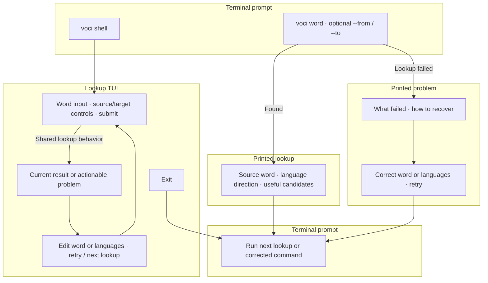

# Problem

When encountering an unfamiliar word, the user leaves the terminal, opens a dictionary site such as LEO.org, enters the word, and scans for useful translations. That interruption is disproportionate to the question: “What does this word mean?” Repeating it makes looking up words feel expensive.

A single machine-translated answer also hides useful distinctions. A word such as `Verbindlichkeit` can carry different meanings; the user needs several relevant candidates to recognize the meaning that fits their context.

This pitch establishes the core lookup experience of `voci`: encounter an unknown word, look it up, and immediately see useful translations. Remembering and learning those words comes later.

# Appetite

**Proposed appetite: two weeks.** This is a spending limit, not an estimate, covering direct CLI lookup and a minimal lookup TUI with German ↔ English support and WikDict as the default dictionary provider, with Microsoft Translator Dictionary Lookup available as an optional provider.

The `voci shell` TUI is limited to one lookup screen. If the work exceeds the appetite, simplify presentation and language detection before expanding the timebox; preserve both entry points, useful dictionary candidates, and explicit language overrides.

# Solution

The solution has four elements: a direct command, a repeat-lookup TUI, shared language handling, and a provider-independent dictionary lookup.

**Direct command.** `voci <word>` prints the source word, the resolved language direction, and a concise set of the most useful translation candidates, then returns to the terminal prompt. No launch screen or interactive confirmation stands between a successful command and its answer.

```bash
voci Verbindlichkeit
voci liability
voci --from de --to en Verbindlichkeit
```

An illustrative result, not a formatting contract or a verified provider response:

```text
Verbindlichkeit · de → en

1. liability
2. obligation
3. commitment
```

Preserve distinct meanings while removing duplicate candidates. Use the dictionary's relevance or sense ordering where available; add a short sense label only when it helps distinguish candidates. Avoid long metadata blocks or an exhaustive dump of synonyms. A word with only one useful candidate can have one result.

**Lookup TUI.** `voci shell` opens an interactive terminal application for looking up several words without relaunching the command. One screen provides a word input, visible source/target controls, and the current result. Submitting a new word replaces the current result. The user can correct the word or languages, retry a failed request, and exit back to their terminal. Session language choices remain available for the next lookup.

The screen presents the same candidates and language decisions as the CLI. While a request is pending, show a lightweight busy state and allow cancellation; a failed lookup leaves the input available for correction. Exact layout and key bindings remain implementation choices. There are no history panes, saved-word lists, or learning screens.

**Language handling.** Initially support German → English and English → German. Explicit source and target choices override detection and configuration. When the source is omitted, use dictionary evidence or lightweight detection when it is reliable enough for a single word. Do not infer a language from capitalization alone or pretend that short, shared words are unambiguous.

Use a small configuration setting for the preferred target, initially English. For an unambiguously German word, the default result is English; for an unambiguously English word, use German as the other language in the initial supported pair. This makes both bare-word examples useful. An explicitly requested target is never silently changed; an explicit source/target combination that cannot be translated gets a clear explanation.

If a word could belong to either language and no source was specified, show the ambiguity with a concrete `--from` correction in the CLI; in the TUI, let the user choose the source and resubmit. There is no hidden interactive prompt in the direct command. If the source cannot be determined, ask for an explicit source instead of reporting a dictionary miss under a guessed language.

Keep language identities and supported pairs explicit rather than baking a two-language toggle into the application. French support should later add German ↔ French and English ↔ French through provider capabilities and language configuration, using the same command shape:

```bash
voci --to fr Verbindlichkeit
```

That command is a future usage example. In this slice, it reports that French is unsupported and names the supported directions. Choosing defaults among three languages will need an explicit policy when French is introduced; the initial two-language convenience must not become an implicit universal rule.

**Shared lookup boundary and default source.** Use **WikDict** by default so the core lookup loop requires no account or API key. The first lookup downloads the two German/English SQLite translation databases and builds a local lookup index; subsequent lookups work offline. Pin a known data release, show setup progress, allow cancellation, and validate temporary downloads before installing them. Keep dictionary files in the user's application data directory, with a configuration override. Persist dictionary data only, not searched words or lookup history. [WikDict downloads](https://www.wikdict.com/page/download)

Preserve sense descriptions and distinct translations. Include WikDict/Wiktionary/DBnary attribution and the CC BY-SA 4.0 source link in results; retain the data license when distributing dictionary adaptations. The translation databases provide a compact starting point, while full inflection coverage and monolingual data packs remain outside this slice. See [dictionary attribution](wikdict-attribution.md) and [observed provider results](provider-validation.md).

**Microsoft Translator Dictionary Lookup** remains an optional online provider for users with credentials. Its API returns alternative translations, parts of speech, and back-translations. Its dictionary pairs are to/from English; direct German ↔ French dictionary lookup would require another source. French remains outside this delivery. [Dictionary Lookup API](https://learn.microsoft.com/en-us/rest/api/translator/translator/dictionary-lookup?view=rest-translator-v3.0), [language support](https://learn.microsoft.com/en-us/azure/ai-services/translator/language-support)

Both interfaces submit requests to the same application service. Provider adapters own source-specific HTTP, SQL, and response mapping; the CLI and TUI consume structured results. Providers declare dictionary and text-translation capabilities separately. The result carries the original query, resolved headword/language pair, distinct candidates and senses, provider identity, attribution, and result kind. Future history can record this data without parsing terminal text; no history storage or learning workflow is introduced here.

Use one configured provider, defaulting to WikDict, with an explicit override shared by the CLI and TUI:

```bash
voci Verbindlichkeit
voci --provider microsoft Verbindlichkeit
voci shell --provider wikdict
```

Query one provider per lookup. Do not silently switch from local to remote lookup, combine providers' rankings, or replace dictionary meanings with machine-translated text. There is no plugin registry or provider-management screen.

Future adapters may include DeepL or Google Cloud Translation for explicitly identified machine-translation results, and PONS for another dictionary source. Translation fallback remains a separate bet. LEO remains a reference for the lookup experience; integrating it would require a supported access route rather than scraping. [DeepL API](https://developers.deepl.com/api-reference/translate/request-translation), [Google documentation](https://docs.cloud.google.com/translate/docs/translate-text), [PONS API](https://bg.pons.com/p/online-dictionary/developers/api)

The breadboard shows entry points and recovery paths; it does not prescribe screen layout. Editable source: [lookup breadboard](pitch--lookup.breadboard.mmd).



Useful failures are part of the lookup loop:

| Situation | Terminal behavior and recovery |
| --- | --- |
| Word not found in a resolved, supported pair | Say that no entry was found for the word and direction; suggest checking spelling or changing the source language. |
| Ambiguous or undetermined source | Explain the uncertainty and how to specify the source. |
| Unsupported language or pair | Name the unsupported choice and the available directions; do not substitute another target. |
| Missing or corrupt WikDict files | Download missing files with visible progress; explain how to remove a corrupt file and retry. Never install a partial download. |
| Provider unavailable or not configured | Explain that lookup is unavailable and whether retrying or setup is needed. Microsoft credentials are required only when Microsoft is selected. |
| Network failure or timeout | Distinguish connectivity failure from a missing word; end the request within a bounded wait and allow retry. |

The CLI reports failures on standard error with a nonzero exit status, without a stack trace in normal use. The TUI shows the same explanation in place and remains usable. Avoid endless automatic retries or silently replacing dictionary results with machine translation.

The finished experience lets a user find several useful meanings with one short command, or repeat the same lookup loop inside `voci shell`, without visiting a website.

# Security

WikDict downloads contact the dictionary host, but local lookups send neither queries nor credentials to a service. Validate downloaded SQLite files before installation, preserve completed files on cancellation, and include source/license attribution. Selecting Microsoft sends the query and language pair to Microsoft and requires credentials kept outside source control and terminal output. Treat all provider text as untrusted when rendering, including terminal control sequences. No lookup history or application query telemetry is introduced.

# Rabbit Holes

- **WikDict coverage and ranking vary.** Preserve real dictionary distinctions without promising exhaustive senses or inflection coverage. Keep first-run download and corruption recovery simple; full dictionary management and automatic updates are separate work.
- **Optional Microsoft result quality and access remain unverified.** Before betting, evaluate authenticated Dictionary Lookup requests in both German/English directions: representative ambiguous words, inflections, misses, and `Verbindlichkeit`. Confirm useful alternatives, acceptable latency, credential setup, cost/quotas, and applicable terms, including implications for later storing results. Documentation establishes API fit but does not prove a satisfying lookup experience. If Microsoft falls short, evaluate PONS or reshape the bet; do not quietly substitute a single-answer translator or build a scraping system.
- **Dictionary lookup needs a resolved source.** Microsoft's Dictionary Lookup endpoint requires explicit source and target languages. The application must resolve them before calling it; any separate detection request adds latency and may still be uncertain for a single word. Keep that uncertainty visible through the existing correction path. [Required parameters](https://learn.microsoft.com/en-us/rest/api/translator/translator/dictionary-lookup?view=rest-translator-v3.0)
- **Single-word detection has limits.** Shared words such as `Gift` can be meaningful in both languages. Prefer an explicit correction path over a general-purpose language-detection project. Dictionary absence, language uncertainty, and service failure must remain different outcomes.
- **Dictionary data can overwhelm the result.** Keep distinct useful meanings, but avoid a lexicography project, exhaustive grammatical metadata, or inventing a relevance-ranking engine.
- **The TUI can consume the entire appetite.** Keep one input/result screen and shared lookup behavior. Terminal responsiveness and returning cleanly to the caller matter; theming, navigation frameworks, and persistent sessions do not belong to this bet.
- **Provider latency can defeat the point.** Confirm that the chosen source supports a quick loop; bound waiting and allow cancellation. Automatic dictionary updates and provider failover are separate bets; the bounded WikDict download is included.
- **Future support can tempt premature infrastructure.** Make provider mapping and language pairs explicit, but defer provider orchestration, three-language default policies, and history storage design until those features are shaped.

# No-Gos

- Vocabulary review, spaced repetition, quizzes, and statistics.
- Lookup history, automatically remembering words, and saved vocabulary workflows.
- A multi-screen or general-purpose full-screen TUI; only the focused lookup TUI is included.
- Anki export, pronunciation, example sentences, tagging, and notes.
- French data/support in this delivery, despite preserving a straightforward extension path.
- Phrase or document translation as a primary use case, and machine-translation fallback.
- Provider adapters beyond WikDict and Microsoft, full monolingual/inflection data packs, and automatic dictionary updates.
- Sophisticated provider management, plugins, multiple-provider aggregation, or automatic failover.
- A configuration wizard, settings UI, or a dedicated machine-readable output format.
